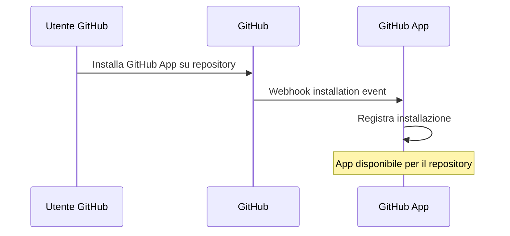
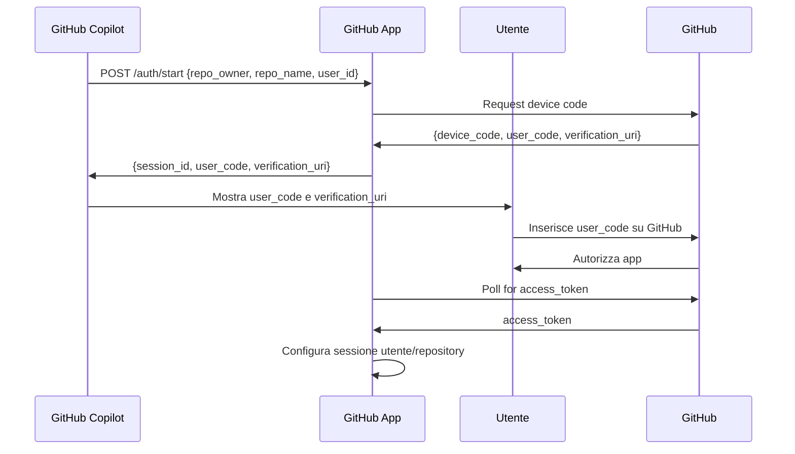
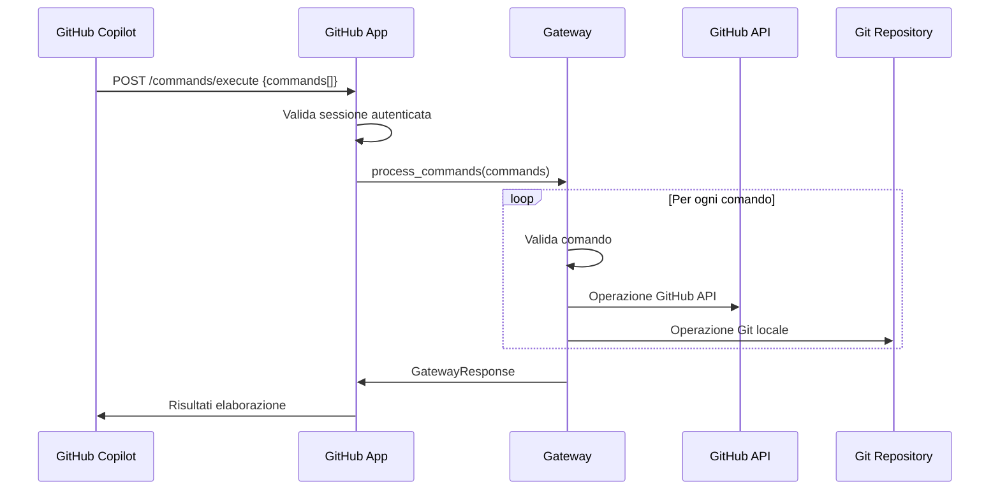

# 📋 Guida Tecnica - GitHub Copilot Extension

## 🏗️ Architettura Generale

L'estensione è stata progettata come **GitHub App pubblica** multi-tenant che utilizza **Device Flow Authentication** per gestire sessioni multiple di utenti e repository.

### Componenti Principali

```
GitHub Copilot Extension
├── 🌐 GitHub App (github_app.py)
│   ├── Multi-tenant session management
│   ├── Webhook handling
│   └── REST API endpoints
├── 🔐 Device Flow Auth (device_flow_auth.py)
│   ├── GitHub authentication
│   ├── Repository detection
│   └── Local clone management
├── 🚪 Gateway (gateway.py)
│   ├── Command processing
│   ├── Validation
│   └── Operation orchestration
├── 📁 Operations
│   ├── File operations (CRUD, search)
│   └── Git operations (commit, push, branch)
└── 🔧 Types & Validation
    ├── Command types and enums
    ├── API interfaces
    └── Input validation
```

## 🔄 Flusso di Funzionamento

### 1. Installazione GitHub App



### 2. Autenticazione Device Flow



### 3. Esecuzione Comandi



## 🔐 Sistema di Autenticazione

### Device Flow Implementation

```python
class GitHubDeviceFlowAuth:
    def start_device_flow(self) -> Dict:
        # 1. Richiedi device code da GitHub
        response = requests.post("https://github.com/login/device/code", {
            "client_id": self.client_id,
            "scope": "repo user"
        })
        
        # 2. Restituisci user_code per autorizzazione
        return {
            "device_code": data["device_code"],
            "user_code": data["user_code"],
            "verification_uri": data["verification_uri"]
        }
    
    def poll_for_token(self, device_code: str) -> Dict:
        # 3. Polling per access_token
        while not expired:
            response = requests.post("https://github.com/login/oauth/access_token", {
                "client_id": self.client_id,
                "device_code": device_code,
                "grant_type": "urn:ietf:params:oauth:grant-type:device_code"
            })
            
            if "access_token" in response:
                self.setup_github_client(response["access_token"])
                return {"success": True}
```

### Multi-Tenant Session Management

```python
class GitHubCopilotApp:
    def __init__(self):
        # Sessioni per utente/repository
        self.user_sessions: Dict[str, GitHubDeviceFlowAuth] = {}
        # Sessioni di autenticazione attive
        self.active_auth_sessions: Dict[str, Dict] = {}
    
    def get_session_key(self, user_id: str, repo_owner: str, repo_name: str) -> str:
        return f"{user_id}_{repo_owner}_{repo_name}"
    
    def get_or_create_session(self, user_id: str, repo_owner: str, repo_name: str):
        session_key = self.get_session_key(user_id, repo_owner, repo_name)
        if session_key not in self.user_sessions:
            self.user_sessions[session_key] = GitHubDeviceFlowAuth()
        return self.user_sessions[session_key]
```

## 📡 API Endpoints

### Autenticazione

#### `POST /auth/start`
Avvia il processo di autenticazione per un repository specifico.

```json
// Request
{
  "repo_owner": "giuseppe-dacunzo-sisal",
  "repo_name": "test-comandi-github", 
  "user_id": "12345"
}

// Response
{
  "success": true,
  "session_id": "device_code_abc123",
  "user_code": "1234-5678",
  "verification_uri": "https://github.com/login/device",
  "message": "Vai su https://github.com/login/device e inserisci: 1234-5678",
  "expires_in": 900
}
```

#### `GET /auth/status/{session_id}`
Controlla lo stato dell'autenticazione in corso.

```json
// Response (pending)
{
  "success": true,
  "status": "pending",
  "message": "In attesa dell'autorizzazione utente"
}

// Response (authenticated)
{
  "success": true,
  "status": "authenticated",
  "user": {
    "login": "giuseppe-dacunzo-sisal",
    "name": "Giuseppe D'Acunzo",
    "email": "giuseppe.dacunzo.ext@sisal.it"
  },
  "repository": {
    "owner": "giuseppe-dacunzo-sisal",
    "name": "test-comandi-github",
    "full_name": "giuseppe-dacunzo-sisal/test-comandi-github"
  }
}
```

### Esecuzione Comandi

#### `POST /commands/execute`
Esegue una lista di comandi per un repository autenticato.

```json
// Request
{
  "repo_owner": "giuseppe-dacunzo-sisal",
  "repo_name": "test-comandi-github",
  "user_id": "12345",
  "commands": [
    {
      "step": 1,
      "command": "create.file",
      "path": "src/nuovo.py",
      "content": "cHJpbnQoIkhlbGxvIFdvcmxkIik="
    },
    {
      "step": 2,
      "command": "commit",
      "content": "QWdnaXVudG8gbnVvdm8gZmlsZQ=="
    }
  ]
}

// Response
{
  "success": true,
  "message": "Elaborazione comandi completata",
  "processed_steps": [
    {
      "step": 1,
      "success": true,
      "message": "File creato con successo",
      "details": {"file_path": "src/nuovo.py", "size": 20}
    },
    {
      "step": 2,
      "success": true,
      "message": "Commit eseguito con successo",
      "details": {"commit_hash": "abc123def456"}
    }
  ],
  "repository_info": {
    "owner": "giuseppe-dacunzo-sisal",
    "repo": "test-comandi-github",
    "full_name": "giuseppe-dacunzo-sisal/test-comandi-github"
  },
  "user_info": {
    "login": "giuseppe-dacunzo-sisal",
    "name": "Giuseppe D'Acunzo"
  }
}
```

## 🔧 Sistema di Comandi

### Command Types Enum

```python
class CommandType(Enum):
    CREATE_FILE = "create.file"
    READ_FILE = "read.file" 
    MODIFY_FILE = "modify.file"
    DELETE_FILE = "delete.file"
    SEARCH_FILE = "search.file"
    PULL = "pull"
    COMMIT = "commit"
    PUSH = "push"
    CREATE_BRANCH = "create.branch"
    SWITCH_BRANCH = "switch.branch"
    CLONE = "clone"
```

